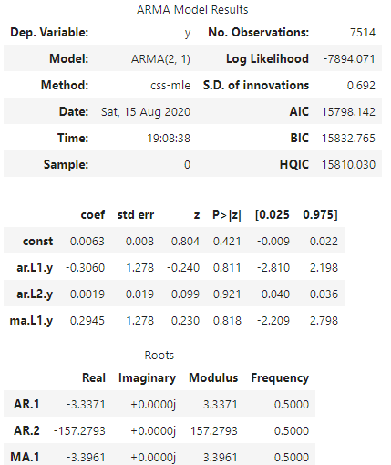
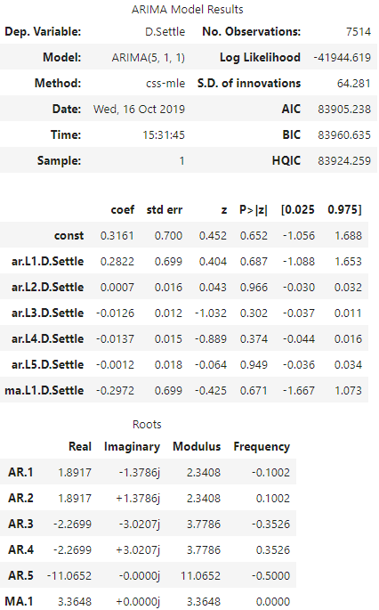
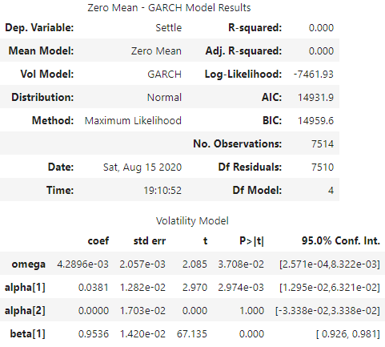
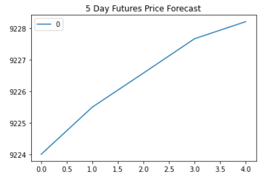
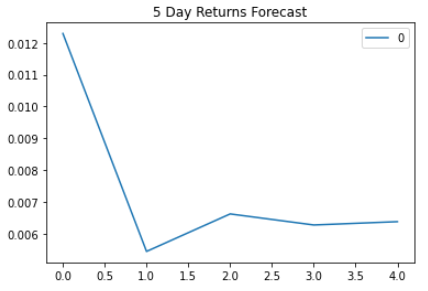
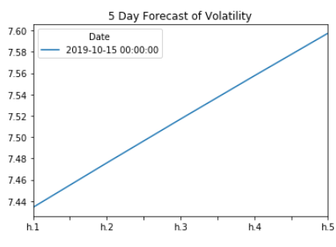
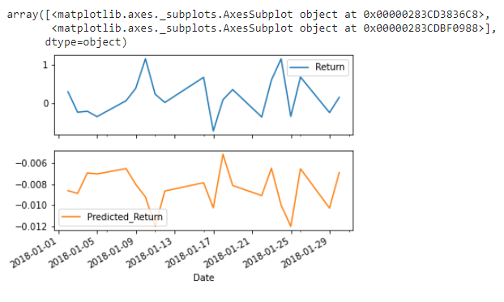

# Time-Series_HW
Homework assignment for the Time Series Analysis portion for the FinTech bootcamp

### Hypothesis:

When it comes to investing, I like to reference a quote. "Time in the market is better than timing the market." My theory is that we should invest in the yen now, instead of waiting for an optimal time or a dip in price. 

### Analysis:

Using the ARMA, ARIMA, Garch and a Linear Regression model we came to the conclusion below. 

These notebooks can be found below. 

1. [Time Series Analysis Notebook](/Assignment/time_series_analysis.ipynb)

2. [Linear Regression Notebook](/Assignment/regression_analysis.ipynb)

### Conclusion:

1. If you're considering getting into the Yen, I would recommend you buy now. As the models have forecasted an upward trend for the next 5 days. Could quickly turn a profit. 

2. However the volatility of the Yen is expected to increase over the next 5 days. 

3. Based on these models, I would recommend you invest 10% or less of your portfolio into the yen. Given how low the predicted changes are, there is always an opportunity for the Yen to go sideways.

4. Would also like to point out that the linear regression model does better with in sample data compared to out of sample data. This could be resolved by taking into account more than one independent variable, however at this time more testing would need to be done. 
